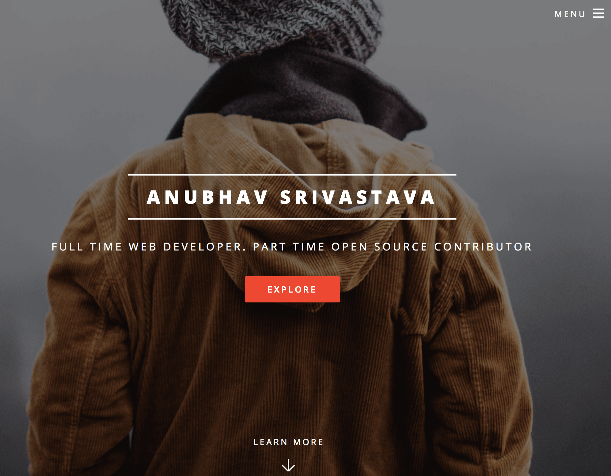

# gatsby-starter-spectral

Gatsby.js V4 starter template based on Spectral by HTML5 UP

For an overview of the project structure please refer to the [Gatsby documentation - Building with Components](https://www.gatsbyjs.org/docs/building-with-components/).


Check online preview [here](https://anubhavsrivastava.github.io/gatsby-starter-spectral/)

## Screenshot



## Install

Make sure that you have the Gatsby CLI program installed:

```sh
npm install --global gatsby-cli
```

And run from your CLI:

```sh
gatsby new <site-name> https://github.com/anubhavsrivastava/gatsby-starter-spectral
```

Then you can run it by:

```sh
cd gatsby-example-site
npm install
gatsby develop
```

### Personalization

Edit `config.js` to put up your details

```javascript
module.exports = {
  siteTitle: 'Gatsby Starter spectral', // <title>
  ...
  heading: 'Anubhav',
  subHeading: 'Web Developer',
  // social
  socialLinks: [
    {
      icon: 'fa-github',
      name: 'Github',
      url: 'https://github.com/anubhavsrivastava',
    }
    ...
  ],
};

```

### Deploying using Github page

`package.json` has a default script that uses `gh-pages` module to publish on Github pages. Simply running `npm run deploy` would publish the site on github pages.

Additionally, it also has [path-prefix](https://www.gatsbyjs.org/docs/path-prefix/) value set for gatsby config in `config.js`. Change `pathPrefix` to relevant path if your gatsby site is hosted on subpath of a domain, `https://theanubhav.com/somePath/`. If you are hosting it as root site, i.e, `https://theanubhav.com/` , remove the pathPrefix configuration.

### Checkout other similar starters

- [gatsby-starter-casual](https://github.com/anubhavsrivastava/gatsby-starter-casual)
- [gatsby-starter-grayscale](https://github.com/anubhavsrivastava/gatsby-starter-grayscale)
- [gatsby-starter-resume](https://github.com/anubhavsrivastava/gatsby-starter-resume)
- [gatsby-starter-newage](https://github.com/anubhavsrivastava/gatsby-starter-newage)
- [gatsby-starter-stylish](https://github.com/anubhavsrivastava/gatsby-starter-stylish)
- [gatsby-starter-solidstate](https://github.com/anubhavsrivastava/gatsby-starter-solidstate)
- [gatsby-starter-readonly](https://github.com/anubhavsrivastava/gatsby-starter-readonly)
- [gatsby-starter-prologue](https://github.com/anubhavsrivastava/gatsby-starter-prologue)
- [gatsby-starter-phantom](https://github.com/anubhavsrivastava/gatsby-starter-phantom)
- [gatsby-starter-paradigmshift](https://github.com/anubhavsrivastava/gatsby-starter-paradigmshift)
- [gatsby-starter-overflow](https://github.com/anubhavsrivastava/gatsby-starter-overflow)
- [gatsby-starter-multiverse](https://github.com/anubhavsrivastava/gatsby-starter-multiverse)
- [gatsby-starter-identity](https://github.com/anubhavsrivastava/gatsby-starter-identity)
- [gatsby-starter-highlights](https://github.com/anubhavsrivastava/gatsby-starter-highlights)
- [gatsby-starter-fractal](https://github.com/anubhavsrivastava/gatsby-starter-fractal)
- [gatsby-starter-eventually](https://github.com/anubhavsrivastava/gatsby-starter-eventually)
- [gatsby-starter-directive](https://github.com/anubhavsrivastava/gatsby-starter-directive)
- [gatsby-starter-creative](https://github.com/anubhavsrivastava/gatsby-starter-creative)
- [gatsby-starter-aerial](https://github.com/anubhavsrivastava/gatsby-starter-aerial)

### Contribution

Suggestions and PRs are welcome!

Please create issue or open PR request for contribution.

### License

[](LICENSE)

refer `LICENSE` file in this repository.

# Warnings

- `warn gatsby-plugin-react-helmet: Gatsby now has built-in support for modifying the document head. Learn more at https://gatsby.dev/gatsby-head`
- `jsx-a11y/click-events-have-key-events 64:11  warning  Avoid non-native interactive elements. If using native HTML is not possible, add an appropriate role and support for tabbing, mouse, keyboard, and touch inputs to an interactive content element  jsx-a11y/no-static-element-interactions`
- `warn /home/fernandovz/Documents/courses/spectral/src/components/Scroll.js   64:11  warning  Visible, non-interactive elements with click handlers must have at least one keyboard listener jsx-a11y/click-events-have-key-events`
- `/home/fernandovz/Documents/courses/spectral/src/pages/Elements.js 170:10  warning  A control must be associated with a text label jsx-a11y/control-has-associated-label 216:10  warning  A control must be associated with a text label jsx-a11y/control-has-associated-label`